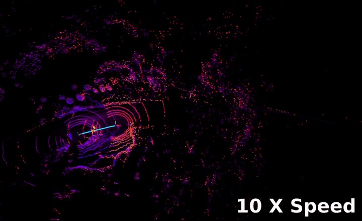

# RTK Mapping

LiDAR mapping system that uses **RTK/GNSS positioning** to build globally-aligned point-cloud maps in real time. Built on [FAST_LIO](https://github.com/hku-mars/FAST_LIO) with an added **GNSS conversion** layer that transforms raw `sensor_msgs/NavSatFix` data into zero-based odometry.

## Overview

```
GNSS NavSatFix ──→ gnss_conversion ──→ /rtk_odom ──→ FAST_LIO (RTK mode)
(lat/lon/alt)     (WGS84→ENU,         (Odometry    (LiDAR mapping with
                   zero-origin)        from 0,0,0)   absolute position)
```

- **`FAST_LIO`** — LiDAR-inertial odometry supporting **three RTK operating modes** (see below). Modified from [hku-mars/FAST_LIO](https://github.com/hku-mars/FAST_LIO).
- **`gnss_conversion`** — Converts raw GNSS fixes (`sensor_msgs/NavSatFix`) into local ENU odometry (`nav_msgs/Odometry`) relative to the first received fix. Handles WGS84→ECEF→ENU transformation, heading-from-motion, antenna offset, jump detection, and origin reset.

## Demo

**RTK Fusion mode (Mode 3) — stable localization with LiDAR point-cloud mapping:**

<<<<<<< HEAD


*Mode 3 — RTK position fused into IEKF with LiDAR point-to-plane constraints. Globally aligned, jitter-smoothed, continuous through RTK dropouts.*
=======
[▶ Watch demo](docs/RTK_MAPPING.mp4)

Mode 3 fuses RTK position into the IEKF as a measurement residual jointly optimized with LiDAR point-to-plane constraints. The trajectory stays globally aligned via RTK while LiDAR scan-matching smooths out GNSS jitter and maintains continuity through signal dropouts.
>>>>>>> 25e8bd7d256834ecbb871fd8331ec341a87a03c8

## Requirements

- **ROS Noetic** (catkin workspace)
- **Eigen3**
- **PCL ≥ 1.8**
- **Livox SDK** (for Livox LiDAR; see [Livox-SDK](https://github.com/Livox-SDK/Livox-SDK))

## Build

```bash
# Clone into your catkin workspace
cd ~/catkin_ws/src
git clone --recursive https://github.com/<your-org>/rtk_mapping.git
cd ..

# Build
catkin_make
# or: catkin build

source devel/setup.bash
```

## FAST_LIO RTK Mapping Modes

FAST_LIO supports three operating modes for RTK/GNSS integration:

| Mode | `rtk_mode_en` | `rtk_fuse_en` | Behavior |
|------|:---:|:---:|---|
| **1. Original FAST_LIO** | `false` | — | Pure LiDAR-IMU odometry. No RTK subscription. |
| **2. RTK Localization** | `true` | `false` | RTK directly overrides EKF state each scan. LiDAR matching disabled. Simple, but trajectory follows RTK noise. |
| **3. RTK Fusion** | `true` | `true` | RTK position added as measurement residual in IEKF, jointly optimized with LiDAR point-to-plane constraints. Smoother, survives RTK dropout. |

### Mode 3: How fusion works

In Mode 3, the IEKF measurement Jacobian `H` is extended with RTK position rows appended to the LiDAR point-to-plane rows:

```
H_full = [ H_lidar (m×12) ]
         [ H_rtk   (3N×12) ]    N = rtk_repeat_n

H_rtk  = [I₃ₓ₃ | 0₃ₓ₉]   repeated N times per RTK position fix
```

Each repetition of the RTK row is mathematically equivalent to reducing RTK measurement noise. Under the unified LiDAR noise model `R_lidar`, repeating N times gives:

```
N · ||pos(x) − z_rtk||² / R_lidar  =  ||pos(x) − z_rtk||² / (R_lidar / N)
```

i.e. effective RTK noise `R_rtk = R_lidar / N`. Higher N = trust RTK more.

### Mode 3 tuning: `rtk_repeat_n`

| RTK accuracy | Recommended N | Effective R_rtk |
|-------------|:---:|:---:|
| 1 cm | 10 | R_lidar / 10 |
| 2 cm | 3–5 | R_lidar / 3–5 |
| 5 cm | 1 | R_lidar (equal weight) |

### Mode comparison

| | Mode 2 (Override) | Mode 3 (Fusion) |
|---|---|---|
| LiDAR scan-matching | ✗ Disabled | ✓ Full IEKF |
| RTK role | Replaces state | Measurement residual |
| Trajectory smoothness | Follows RTK jitter | Smoothed by LiDAR |
| RTK dropout | Mapping stops | Falls back to LiDAR-only |
| Drift without RTK | Immediate | LiDAR-IMU maintains |
| Computational cost | Low | Same as original FAST_LIO |

## Usage

### 1. Launch GNSS conversion

```bash
roslaunch gnss_conversion gnss_conversion.launch \
    input_rtk_topic:=/your_gnss_fix \
    output_odom_topic:=/rtk_odom
```

Configurable parameters (see `gnss_conversion/config/gnss_conversion.yaml`):

| Parameter | Default | Description |
|-----------|---------|-------------|
| `input_rtk_topic` | `/rtk_fix` | Input GNSS topic (`sensor_msgs/NavSatFix`) |
| `output_odom_topic` | `/rtk_odom` | Output odometry topic (`nav_msgs/Odometry`) |
| `publish_tf` | `true` | Broadcast `odom→base_link` TF |
| `jump_threshold` | `50.0` | Reset origin on position jump (meters) |
| `heading_min_speed` | `0.5` | Min speed (m/s) to compute heading from motion |
| `antenna_offset_x/y/z` | `0.0` | GNSS antenna offset in base_link frame |

### 2. Configure FAST_LIO mode

Edit `FAST_LIO/config/velodyne_rtk.yaml`:

```yaml
rtk:
    rtk_mode_en: true        # enable RTK (false = Mode 1)
    rtk_topic: "/rtk_odom"
    rtk_fuse_en: true        # true = Mode 3 (fusion), false = Mode 2 (override)
    rtk_repeat_n: 5          # Mode 3 only: trust RTK ~5× more than LiDAR
```

### 3. Launch

```bash
# Terminal 1
roslaunch gnss_conversion gnss_conversion.launch

# Terminal 2
roslaunch fast_lio mapping_velodyne_rtk.launch
```

To switch modes, only the YAML config needs changing — no code recompilation required.

## Packages

| Package | Description |
|---------|-------------|
| [`FAST_LIO`](FAST_LIO/) | LiDAR-inertial odometry + RTK mapping mode (modified from [hku-mars/FAST_LIO](https://github.com/hku-mars/FAST_LIO)) |
| [`gnss_conversion`](gnss_conversion/) | GNSS NavSatFix → zero-based odometry conversion |

## Coordinate Frames

- **`odom`** — Local ENU frame with origin at the first GNSS fix
- **`base_link`** — Vehicle body frame (TF broadcast by `gnss_conversion`)
- **`camera_init`** — FAST_LIO map frame (first LiDAR scan pose)

## License

FAST_LIO is distributed under BSD license. See [FAST_LIO/LICENSE](FAST_LIO/LICENSE).
